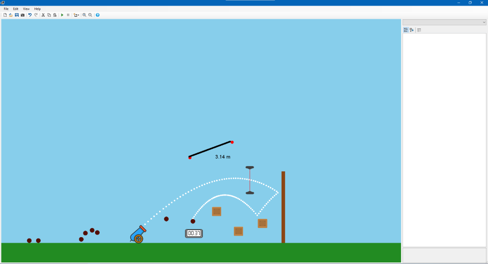

# Projectile-Simulator
Respository for Projectile-Simulator project.

Format: 

## Features
* Real-time physical simulation of projectile motion.
* The projection angle and speed that a projectile is fired from a cannon can be varied.
* Ability to change properties of projectile.
* Drag forces on projectiles can be enabled.
* Dynamic collisions between projectiles and boxes.
* Saving and loading of simulation to a file.

## Instructions
* Choose a simulation template to get started.
* Use mouse scroll wheel to zoom in and out on a point in the simulation.
* Hold middle mouse button and drag to pan simulation.
* Use left mouse button to select objects, or alternatively, use inspector in right hand pane.
* Use property editor in inspector to vary properties of objects.
* Use the new object button in the toolbar to add an object to the simulation.
* Use play and pause buttons in the toolbar to pause and resume the simulation.
